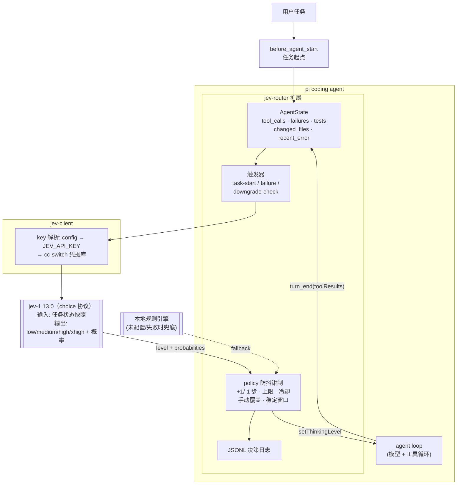
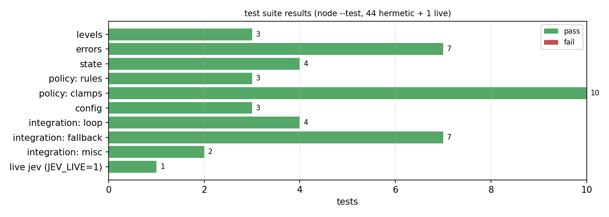
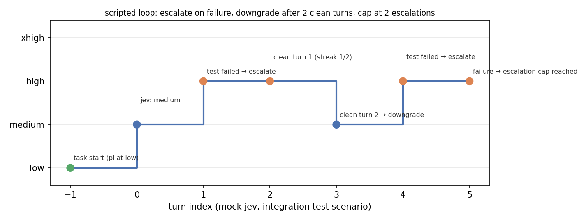
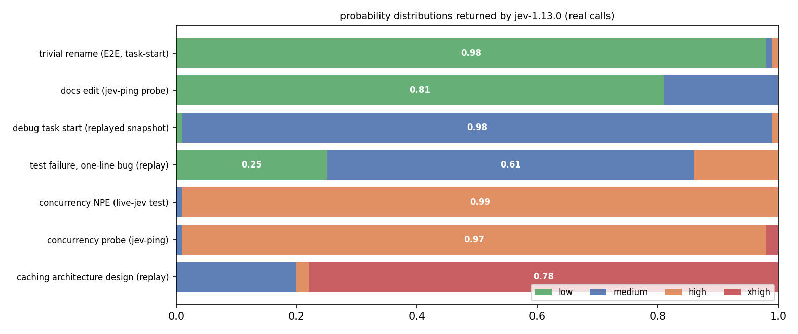
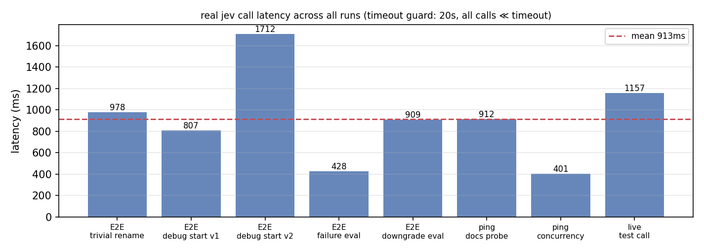
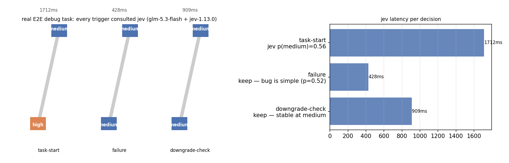

# pi-jev-router — 基于 Jev 的自适应 Thinking Level Router

> 一个 [pi coding agent](https://pi.dev) 扩展：根据当前任务状态与执行反馈，动态选择模型的 Thinking Level（`low / medium / high / xhigh`），在保证任务成功率的前提下尽量用更低的推理档位，降低成本与延迟。
>
> **它不切换模型，不写代码，不碰 Agent Loop** —— 只做一件事：读状态 → 问 Jev（或本地规则兜底）→ `pi.setThinkingLevel()`。

[]() []() []()

---

## 1 它解决什么问题

| 任务 | 合理档位 | 固定档位的代价 |
|---|---|---|
| 改个变量名 / 简单配置 | **low** | 固定 high → 白白烧推理 token |
| 普通功能开发 / 一般 bug 修复 | **medium** | 固定 low → 复杂任务成功率下降 |
| 复杂 debug / 并发 / 多文件重构 | **high** | |
| 大型架构设计 / 多次失败后的深水区 | **xhigh** | |

档位不应该在任务开始时定死：**第一次尝试失败了，问题可能变难；连续顺利，可能又变简单**。pi-jev-router 把这个判断交给 Jev（一个高效的离散选择概率模型），把"持续重估"挂进 pi 的事件回路。

## 2 系统结构



- **实线** = 决策路径；**虚线** = 兜底路径。
- 扩展只监听 pi 事件（`before_agent_start` / `turn_end` / `thinking_level_select` / `agent_settled`），唯一的写操作是 `pi.setThinkingLevel()`。`turn_end` 处理器在下一轮 LLM 调用前被 await（已核实 pi 源码 `agent-session.js`），因此调级精确作用于同一次 agent run 的下一次请求。

## 3 决策时机（避免过度调用）

| 时机 | 触发条件 | 行为 |
|---|---|---|
| **task-start** | 新任务（steer/follow-up 不算） | 问 Jev 初始档位（未配置 → 规则引擎按任务类型定基线） |
| **failure** | 出现**推理型**失败（测试失败/编译错误/断言/异常） | 问 Jev 是否升级；**新鲜失败绕过冷却窗口** |
| **downgrade-check** | 连续 `downgradeStableTurns` 轮无失败 | 问 Jev 是否降级（有稳定性窗口 + 基线地板） |
| ~~每个 tool call~~ | ✗ | 从不 |
| ~~每个 token~~ | ✗ | 从不 |

**环境型失败（网络断连、Docker 未启动、磁盘满、限流 429…）永不触发升级**——更多推理解决不了网络故障（spec §8）。本地分类器先过滤，只有推理型失败才进入升级评估，且不会调用 Jev。

## 4 防抖（anti-flap）

- **每次决策最多 ±1 步**（task-start 的初始选择除外）；
- 每任务升级上限 `maxEscalationsPerTask: 2`、降级上限 `maxDowngradesPerTask: 2`；
- 降级需要 `downgradeStableTurns: 2` 连续干净轮次，且默认不低于任务基线（长期稳定 ×2 才允许击穿到更低）；
- 调级后 `pinTurns: 1` 轮内锁定；
- Jev 调用间隔 `minCallIntervalMs: 15000`，但**新失败旁路冷却**（回归测试覆盖）；
- 用户手动改档（`/thinking`、Shift+Tab）→ **manual-override**：路由器沉默到下一任务。

## 5 安装与配置

```bash
# 方式一：注册到 pi settings（推荐，跟随 git 仓库更新）
#   ~/.pi/agent/settings.json:
#   "extensions": ["C:/Users/Administrator/Documents/pi-jev-router"]

# 方式二：临时加载
pi -e ./index.ts
```

配置文件 `~/.pi/jev-router.json`（也可用 `/jev-router set <key> <value>`）：

```json
{
  "enabled": true,
  "endpoint": "<jev 端点>",
  "model": "jev-latest",
  "providerId": "<cc-switch 凭据库中的 provider id>",
  "timeoutMs": 20000,
  "minCallIntervalMs": 15000,
  "maxEscalationsPerTask": 2,
  "maxDowngradesPerTask": 2,
  "downgradeStableTurns": 2,
  "pinTurns": 1,
  "logEnabled": true,
  "logFile": "~/.pi/jev-router/decisions.jsonl"
}
```

API key 解析顺序：`config.apiKey` → `JEV_API_KEY` 环境变量 → cc-switch 凭据库（与 [pi-decision-prior] 相同的解析链）。
**未配置 endpoint/model 时：会话开始弹一次警告，之后由本地规则引擎接管路由**——任务类型决定基线（documentation→low，implementation/debugging/refactoring/testing→medium，architecture/optimization→high），失败照常升级，一切照常工作。

### 命令

```
/jev-router            # 开关自动路由（写入配置，重启会话保留）
/jev-router status     # 当前状态：档位来源 / 计数 / 日志路径
/jev-router test       # 连通性测试（真实问一次 Jev）
/jev-router set k v    # 改配置
/jev-router log        # 最近 5 条决策
```

状态栏徽标：`jev:medium`（Jev 主导）/ `jev:medium(rules)`（本地规则）/ `jev:medium(fallback)`（Jev 失败兜底）/ `jev:medium(manual)`（用户接管）。

### 日志（实验用，spec §12）

JSONL，两种条目。`reason` 一律由本地钳制层生成；Jev 本身只回答档位。

```json
{"kind":"decision","timestamp":"...","task_id":"b752ab7a","trigger":"task-start",
 "source":"jev","task_type":"implementation","thinking_level_before":"high",
 "thinking_level_after":"low","changed":true,"clamped":false,
 "reason":"initial level for implementation task via jev (confidence 0.98)",
 "previous_failures":0,"tool_calls":0,"tests_run":0,"tests_failed":0,
 "context_tokens":0,"jev_latency_ms":978,"jev_confidence":0.98,
 "jev_probabilities":{"low":0.98,...},"execution_time_ms":979}
```

---

## 6 验证

三层验证：**单元/集成测试（全离线）→ 真实 Jev 连通性 → 真实 pi 端到端**。



### 6.1 单元 + 集成测试（44 项，全离线）

```bash
npm test        # node --test test/
```

覆盖：档位解析与折叠、错误分类（环境 vs 推理，含"裸 500 不得误判"等对抗样本）、状态计数、规则引擎、**全部钳制规则**（+1/-1 步、上限、地板、锁定、冷却、新鲜失败旁路）、配置校验。集成测试用 **mock Jev HTTP 服务器**走完整回路：task-start → 失败升级 → 干净降级 → 再失败 → 上限钳制 → 手动接管 → fallback（HTTP 500 / 畸形回答 / 未配置 / 非推理模型 / 关闭开关）→ JSONL 字段断言。

关键回归用例（由真实 E2E 发现的 bug 驱动，见 §6.4）：

```
✔ fresh failure bypasses the cooldown left by the task-start call
✔ downgrade right after an escalation is pinned
✔ environment-only failures never escalate nor call jev
✔ jev HTTP failure -> falls back to local rules, keeps routing alive
✔ malformed jev answer -> fallback, invalid level never applied
```

### 6.2 脚本化全回路（集成测试场景）



mock Jev 按脚本应答，验证档位曲线完全符合设计：low →(jev)→ medium →(测试失败)→ high →(2 轮干净)→ medium →(再失败)→ high →(再失败)→ **上限钳制保持 high**。

### 6.3 真实 Jev 连通性与判别力

```bash
JEV_LIVE=1 JEV_ENDPOINT=... JEV_MODEL=jev-latest node --test test/live-jev.test.ts
JEV_ENDPOINT=... JEV_MODEL=jev-latest node scripts/jev-ping.ts
```

真实 jev-1.13.0 的响应分布（全部为真实调用记录，含重放快照；jev 非确定性，同快照两次调用分布不同）：



- 琐碎重命名 → **low** (p=0.98)；文档改动 → **low** (0.81)
- 调试任务起点 → **medium** (0.98)；测试失败但 bug 是一行修复 → **保持 medium** (0.61, low=0.25 —— 它真的会考虑"不升级")
- 并发 NPE 排查 → **high** (0.99/0.97)
- 全新缓存架构设计 → **xhigh** (0.78) —— 只有真正的架构级任务才给出 xhigh，符合"最后一级"定位

延迟（全部 ≪ 20s 超时守卫）：



### 6.4 真实 pi 端到端（glm-5.3-flash + jev-1.13.0）

```bash
pi -e ./index.ts --no-session -p "<任务>"
```

三个真实任务（决策日志 `~/.pi/jev-router/decisions.jsonl`）：

| 任务 | task-start 决策 | 后续触发 | 结果 |
|---|---|---|---|
| `app.js` 重命名变量（琐碎） | **high → low**（jev p(low)=0.98, 978ms） | — | 1 次工具调用完成，全程 low ✅ |
| "先跑测试再修复"（calc.js 整数除法 bug，第 1 次运行） | high → medium（jev conf 0.65） | （模型先修后测，未产生失败） | ✅ |
| 同任务第 2 次（强制先跑失败测试） | high → medium（conf 0.56, 1712ms） | **failure 触发 → Jev 428ms 应答 → 主动保持 medium**（一行 bug 不值得升档）；downgrade-check → 保持 | 测试 1/2 失败后恢复，最终 medium 修完 ✅ |



左：E2E 调试任务的三个决策点（每个触发都真实咨询了 Jev）；右：各决策的 Jev 延迟。

**§6.4 的副产品：一个真实 bug。** 第一次 E2E 调试运行中，turn 0 的测试失败被 task-start 调用留下的 15s 冷却窗口**静默吞掉**（18.5s 的短任务整个落在窗口内）。修复方式是"新鲜失败旁路"：只要存在上次 Jev 调用未见过的推理失败，失败触发就绕过冷却。该回归场景已固化进集成测试（§6.1 第一条 ✔）。第二次 E2E 运行确认修复生效。

### 6.5 结果小结

1. **闭环成立**：任务起点、失败、降级三个触发点都真实到达 Jev，钳制层只在必要时修正；
2. **Jev 有自己的"反升级"判断**：一行 bug 的测试失败它选择保持 medium（p=0.61），并非无脑升级——符合"能用低等级就不升"的核心目标；
3. **失败安全可用**：HTTP 500 / 畸形回答 / 未配置 / 非推理模型 / 手动接管，全部回到安全路径且留痕；
4. **成本观感**：Jev 单次调用 0.4–1.7s、数百 token，相对一次被避免的 high/xhigh 主模型推理是净赚；琐碎任务被压到 low 的收益在 E2E 中直接可观测。

## 7 限制与边界（如实报告）

- pi 不暴露"相关文件"概念，`relevant_files` 用 read/grep 与 edit/write 路径去重近似；
- `task_type` 是本地关键词启发分类，最终解释权在 Jev（状态快照里带了原文）；
- `thinking_level_select` 是通知型事件，无法阻止用户手动改档，只能检测并让位；
- 非 TUI 模式（`-p`）下 `notify`/`setStatus` 是空操作，日志文件是主要观测面；
- Jev 是概率模型且非确定性：同快照两次调用分布可能不同（§6.3 已观测），钳制层保证这不会造成档位抖动；
- TUI 状态栏徽标在 print 模式不可见，需要在交互模式人工确认（本文档所有验证均在 `-p` 模式完成）。

## 8 第二阶段路线图

历史任务统计 → 按任务类型的最佳档位学习 → 成功率/Token 成本/延迟报表 → 失败原因分类细化 → Context-aware routing（把会话摘要纳入状态）→ Jev 决策缓存 → 自适应策略（从 JSONL 日志学习各触发点的最优钳制参数）。

## 9 仓库结构

```
pi-jev-router/
├── index.ts            # pi 扩展入口：事件接线 + /jev-router 命令
├── src/
│   ├── engine.ts       # 决策编排（可测试核心）
│   ├── policy.ts       # 本地规则引擎 + 防抖钳制
│   ├── jev-client.ts   # jev choice 协议客户端 + key 解析
│   ├── state.ts        # AgentState 收集 + 任务类型分类
│   ├── errors.ts       # 环境型 vs 推理型错误分类
│   ├── config.ts       # 配置加载/保存/校验
│   ├── logger.ts       # JSONL 决策日志
│   └── levels.ts       # 档位类型与折叠规则
├── test/               # unit / integration(mock jev) / live-jev
├── scripts/
│   ├── jev-ping.ts     # 连通性双探针
│   └── charts.py       # 本 README 全部图表（可复现）
└── assets/             # 生成的 PNG
```

---

*实验环境：pi 0.86.1 · glm-5.3-flash（某商业中转的受限通道，身份略）· jev-1.13.0（专有协议，细节略）· Node 24 · Windows。数据来自本仓库测试与 `~/.pi/jev-router/decisions.jsonl` 真实运行记录；图表由 `python scripts/charts.py` 从转写数据生成。*
